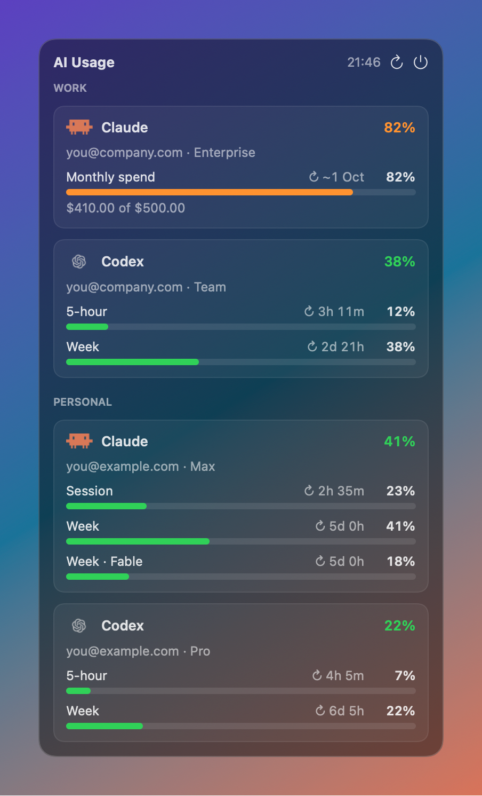

# AI Usage

A tiny macOS menu bar app that shows how much of your **Claude Code** and **Codex** subscription
limits you've used, for **several accounts at once**.

<p align="center">
  <br><br>
  
</p>

If you switch between logins with `CLAUDE_CONFIG_DIR` or `CODEX_HOME` (a work account and a
personal one, say), this shows all of them side by side. It reads the logins the CLIs already have,
so there's nothing to sign in to.

## Features

- **One number per account in the menu bar:** the used percentage of its tightest limit, with a
  Claude or Codex icon, and a dot between groups of accounts.
- **Every limit in the dropdown**, with the time until it resets:
  - **Claude:** 5-hour session, weekly, per-model weekly (e.g. Fable), and the monthly spend
    cap on Enterprise plans.
  - **Codex:** 5-hour, weekly, and any extra per-model limits.
- **Colour-coded:** bars turn orange at 75% and red at 90%.
- **Read-only and safe:** never writes to the CLIs' files or keychain items and never refreshes
  their tokens. See [Safety](#safety).
- **Small and native:** SwiftUI `MenuBarExtra` with a rounded Liquid Glass panel on macOS 26+
  (a translucent material on older versions), no Dock icon, no dependencies, and no Xcode
  project (just SwiftPM).

## Requirements

- macOS 14 (Sonoma) or later
- Swift 6 toolchain (Xcode or the Command Line Tools)
- A Claude Code and/or Codex CLI login on the Mac

## Install

```sh
git clone https://github.com/kletse/kletse-ai-usage-macos.git
cd kletse-ai-usage-macos
scripts/bundle.sh
```

`bundle.sh` builds a release binary, wraps it in `AIUsage.app` (ad-hoc signed), installs it to
`~/Applications`, and starts it. Run it again to update. The app turns on *Open at login* the
first time it starts; you can switch that off in System Settings → General → Login Items.

## Configure your accounts

On first run the app creates `~/.config/ai-usage/accounts.json`. Edit it to match your logins;
changes are picked up on the next refresh (every 5 minutes, or click ↻).

```json
[
  { "name": "Claude", "group": "Work",     "provider": "claude", "dir": "~/.claude-work" },
  { "name": "Codex",  "group": "Work",     "provider": "codex",  "dir": "~/.codex-work" },
  { "name": "Claude", "group": "Personal", "provider": "claude", "dir": "~/.claude" },
  { "name": "Codex",  "group": "Personal", "provider": "codex",  "dir": "~/.codex" }
]
```

| Field | Meaning |
| --- | --- |
| `name` | Shown in the dropdown. |
| `provider` | `claude` or `codex`. |
| `dir` | That login's `CLAUDE_CONFIG_DIR` or `CODEX_HOME`. Use `~/.claude` / `~/.codex` for the default login. |
| `group` | Optional. Accounts in a group are shown together under a header, with a dot between groups in the menu bar. |
| `keychainService` | Optional, Claude only. Overrides the keychain item name (see below). |
| `short` | Optional legacy label; reserved for compatibility. |

The order of the list is the order in the menu bar and the dropdown. For example, with shell
aliases like these you would add `~/.claude-work` and `~/.codex-work` as above:

```sh
alias cc='CLAUDE_CONFIG_DIR=~/.claude-work claude'
alias co='CODEX_HOME=~/.codex-work codex'
```

## How it works

### Claude Code

- **Endpoint:** `GET https://api.anthropic.com/api/oauth/usage`, the same one `/usage` uses.
- **Token:** read from the login keychain with `/usr/bin/security`, the tool Claude Code itself
  uses to store it, so macOS doesn't show a keychain prompt.
- **Keychain item name:** `Claude Code-credentials` for the default `~/.claude`. With
  `CLAUDE_CONFIG_DIR` set, Claude Code adds a suffix: the first 8 hex characters of the SHA-256 of
  the absolute config path, e.g. `Claude Code-credentials-1a2b3c4d`. The app works this out for
  you.
- **Enterprise plans** report a monthly spend cap instead of session and weekly windows. The API
  doesn't say when it resets, so the app assumes the 1st of the month (shown as `~`).
- **When the token has expired**, the app shows the usage Claude Code last cached in its
  `.claude.json`, marked as cached, until you next use the CLI.

### Codex

- **Endpoint:** `GET https://chatgpt.com/backend-api/wham/usage`, the data behind `/status`.
- **Token:** the ChatGPT login from `$CODEX_HOME/auth.json`.
- **If the request fails**, the app shows the newest rate-limit snapshot Codex wrote to
  `$CODEX_HOME/sessions/`, marked as cached.

## Safety

- **Read-only.** The app never writes to the CLIs' config files or keychain items.
- **No token refresh.** Refreshing would rotate the refresh token and could log the CLI out, so
  the app leaves that to the CLI and picks up the new token on the next poll.
- **No secrets in output.** Tokens stay in memory. Errors show HTTP status codes, never response
  bodies or tokens.
- **Gentle on the APIs.** It polls every 5 minutes and backs off when asked to (`429` +
  `Retry-After`).

These are private, undocumented endpoints that the official CLIs use. They can change at any
time, which may break the app until it's updated.

## Development

```sh
swift build
python3 tests/check_diagnostics.py                    # verify diagnostic privacy
swift run AIUsage --dump                              # print sample usage as text
swift run AIUsage --render-panel panel.png --dark     # render a sample dropdown
swift run AIUsage --render-menubar menubar.png --dark # render a sample menu bar
AI_USAGE_CONFIG=/tmp/test.json swift run AIUsage      # use another config in the live app
```

All diagnostic commands use synthetic accounts and usage, and never read your account config,
credentials, or session logs or call usage APIs. `--sample` remains accepted for compatibility,
but sample data is mandatory even without it. Invalid command-line arguments exit without
starting the live app. Image-write failures show a generic error without filesystem paths.
The screenshots in `docs/` contain only sample data.


| File | Purpose |
| --- | --- |
| `Sources/AIUsage/ClaudeProvider.swift` | Claude keychain lookup, usage request, cache fallback |
| `Sources/AIUsage/CodexProvider.swift` | Codex `auth.json`, usage request, session-log fallback |
| `Sources/AIUsage/UsageStore.swift` | Polling, back-off, state per account |
| `Sources/AIUsage/Views.swift` | Menu bar extra and dropdown UI |
| `Sources/AIUsage/Icons.swift` | Provider icons and the menu bar image |
| `Sources/AIUsage/Config.swift` | `accounts.json` loading and defaults |
| `scripts/bundle.sh` | Builds, signs, installs and launches the `.app` |

## Credits

- Inspired by [CodexBar](https://github.com/steipete/CodexBar) by Peter Steinberger, whose source
  showed how to read these endpoints safely.
- The Codex icon is the OpenAI knot as shipped in CodexBar (MIT). The Claude icon is drawn from
  the block characters Claude Code prints on startup.

Not affiliated with or endorsed by Anthropic or OpenAI. Claude and Claude Code are trademarks of
Anthropic; Codex and OpenAI are trademarks of OpenAI.

## License

[MIT](LICENSE) © 2026 Ward Werbrouck
